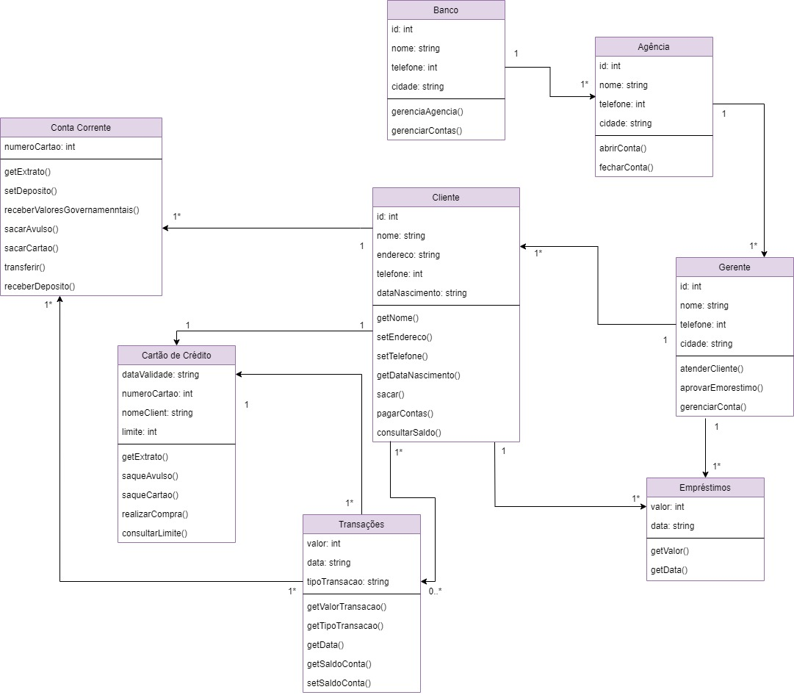

# 
Grajauex Bank

Um projeto { Reprograma }

💡 Bancos comunitários são serviços financeiros solidários que visam gerar trabalho e renda, promovendo o desenvolvimento de economias locais, especialmente em territórios de baixa renda, por meio do apoio à economia popular e solidária.

📌 O Grajauex Bank é um banco comunitário do bairro periférico Grajaú, localizado na zona sul de São Paulo.

🔦 Paradigma de programação utilizado: Programação Orientada a Objetos (POO)

## Serviços financeiros oferecidos pelo Grajaux Bank:
* Crédito para financiamento de empreendimentos solidários.
* Crédito para consumo pessoal e familiar, sem juros.
* Cartão de crédito popular solidário.
* Abertura e extrato de conta corrente.
* Depósito em conta corrente.
* Saque avulso ou com cartão magnético.
* Pagamento de contas (água, luz, telefone etc.).
* Recebimento de aposentadorias e outros valores governamentais
* Gerentes da conta
* Prestação de contas diário e semanal para toda a comunidade

## Diagrama de Classes
